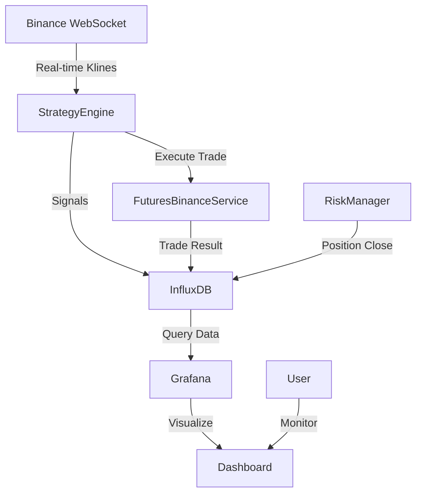

# 🤖 Crypto Trading Bot - TurkNinja

> **Professional Algorithmic Trading Engine for Binance Futures**  
> Enterprise-grade bot with institutional-level risk management, InfluxDB time-series storage, and real-time visualization

[](https://openjdk.org/)
[](https://spring.io/projects/spring-boot)
[](https://www.influxdata.com/)
[](/)
[](/)

[🇹🇷 Türkçe](#-türkçe-dokümantasyon) | [🇬🇧 English](#-english-documentation)

---

## 🇹🇷 Türkçe Dokümantasyon

### 🚀 Özellikler

#### **Stratejik Zeka (Algorithmic Intelligence)**

| Özellik | Durum | Açıklama |
|---------|-------|----------|
| **✅ Adaptif Parametreler** | AKTIF | Volatiliteye göre RSI eşikleri otomatik ayarlanır |
| **✅ Korelasyon Filtresi** | AKTIF | Yüksek korelasyonlu pozisyonları engeller (%40-60 risk azalması) |
| **✅ Çoklu Zaman Dilimi** | AKTIF | 1h trend kontrolü ile 5m giriş (fakeout koruması) |
| **✅ Kelly Kriteri** | HAZIR | Kazanma oranına göre dinamik pozisyon büyüklüğü (20+ işlem sonrası) |
| **✅ ATR Bazlı Sizing** | AKTIF | Volatiliteye göre pozisyon ayarlama |
| **✅ InfluxDB Entegrasyonu** | AKTIF | Gerçek zamanlı veri depolama ve analiz |

#### **Risk Yönetimi (Risk Management)**

- **🛡️ Order Book Aware Stop Loss** - Likidite duvarlarına göre SL yerleştirme
- **📊 Trailing Stop** - %0.3 aktivasyon eşiği ile kar koruma
- **🔴 Circuit Breaker** - 3 ardışık zarar sonrası 30dk otomatik durdurma
- **📉 Günlük Zarar Limiti** - Maksimum günlük kayıp kontrolü
- **⚖️ Pozisyon Limiti** - Maksimum 5 eş zamanlı pozisyon

#### **Teknik Altyapı (Technical Infrastructure)**

- **⚡ Async Order Execution** - Virtual Threads ile non-blocking emir gönderimi
- **🔄 Resilience4j** - Exponential backoff retry (500ms→1s→2s→4s)
- **🔌 Circuit Breaker** - API arızalarında otomatik koruma
- **🚀 Mac ThreadLocal** - %30 daha hızlı API imza oluşturma
- **📊 InfluxDB Time-Series** - Sinyal, trade ve performans verisi depolama
- **📈 Grafana Dashboard** - Gerçek zamanlı görselleştirme (opsiyonel)

---

### ⚙️ Kurulum

#### **1. Gereksinimler**
```bash
Java 21+
Maven 3.9+
Docker & Docker Compose (InfluxDB & Grafana için)
Binance Futures API Key
```

#### **2. InfluxDB & Grafana Başlatma**

```bash
# Docker container'ları başlat
docker-compose up -d

# Container durumunu kontrol et
docker ps
```

**InfluxDB Erişim:**
- URL: http://localhost:8086
- Org: `turkninja`
- Bucket: `trading_data`
- Token: `dev-token-please-change-in-production`

**Grafana Erişim:**
- URL: http://localhost:3000
- Username: `admin`
- Password: `admin`

#### **3. Konfigürasyon**

**.env Dosyası:**
```bash
BINANCE_API_KEY=your_api_key
BINANCE_SECRET_KEY=your_secret_key
TELEGRAM_BOT_TOKEN=your_bot_token
TELEGRAM_CHAT_ID=your_chat_id

# InfluxDB Configuration
INFLUXDB_URL=http://localhost:8086
INFLUXDB_TOKEN=dev-token-please-change-in-production
INFLUXDB_ORG=turkninja
INFLUXDB_BUCKET=trading_data
INFLUXDB_ENABLED=true
```

**application.properties Önemli Ayarlar:**
```properties
# InfluxDB - Time Series Database
influxdb.url=http://localhost:8086
influxdb.token=dev-token-please-change-in-production
influxdb.org=turkninja
influxdb.bucket=trading_data
influxdb.enabled=true

# Strateji
strategy.timeframe=5m
strategy.adx.min.strength=25

# Adaptif Parametreler
strategy.adaptive.enabled=true

# Korelasyon
risk.correlation.enabled=true
risk.correlation.threshold=0.75

# Multi-Timeframe
strategy.mtf.enabled=true
strategy.mtf.higher.timeframe=1h

# Kelly Criterion (20+ işlem sonrası)
strategy.position.kelly.enabled=false
strategy.position.kelly.min_trades=20

# ATR Position Sizing
strategy.position.atr.enabled=true

# Risk
risk.max.daily.loss=0.10
risk.max.concurrent.positions=5
strategy.circuit.breaker.enabled=true
```

#### **4. Çalıştırma**
```bash
# Tüm sistemi başlat (InfluxDB + Grafana + Bot)
./start.sh

# Logları izle
tail -f startup_log.txt

# Sistemi durdur
./stop.sh
```

---

### 📊 InfluxDB Veri Yapısı

Sistem aşağıdaki measurement'ları InfluxDB'ye yazar:

#### **1. Klines (OHLCV Verileri)**
```
Measurement: klines
Tags: symbol, interval
Fields: open, high, low, close, volume
```

#### **2. Signals (Trading Sinyalleri)**
```
Measurement: signals
Tags: symbol, type, status
Fields: price, executed, reason
```

#### **3. Trades (İşlem Detayları)**
```
Measurement: trades
Tags: symbol, side
Fields: entry_price, quantity, position_size_usdt, notional_value
```

#### **4. Position Closes (Pozisyon Kapanışları)**
```
Measurement: position_closes
Tags: symbol, side, reason
Fields: exit_price, pnl, duration_seconds, win
```

---

### 📈 Grafana Dashboard Kurulumu

1. **InfluxDB Data Source Ekle:**
   - Configuration → Data Sources → Add data source
   - Select: InfluxDB
   - Query Language: Flux
   - URL: `http://influxdb:8086`
   - Organization: `turkninja`
   - Token: `dev-token-please-change-in-production`
   - Default Bucket: `trading_data`

2. **Dashboard'ları Import Et:**
   - Dashboards → Import
   - Hazır Grafana dashboard'ları yakında eklenecek

---

### 📦 Teknoloji Stack

| Kategori | Teknoloji | Versiyon |
|----------|-----------|----------|
| **Dil** | Java | 21 (Virtual Threads) |
| **Framework** | Spring Boot | 3.2.x |
| **Time-Series DB** | InfluxDB | 2.7 |
| **Visualization** | Grafana | 10.2.0 |
| **Indicators** | TA4j | 0.16 |
| **HTTP Client** | OkHttp | 4.12 |
| **Resilience** | Resilience4j | 2.1.0 |
| **JSON** | org.json | 20231013 |

---

### 🏗️ Sistem Mimarisi



---

## 🇬🇧 English Documentation

### 🚀 Quick Start

#### **Requirements**
- Java 21+
- Maven 3.9+
- Docker & Docker Compose
- Binance Futures API Key

#### **Installation**

```bash
# 1. Start InfluxDB and Grafana
docker-compose up -d

# 2. Configure environment
cp .env.example .env
# Edit .env with your API keys

# 3. Start trading bot
./start.sh
```

#### **Access Points**
- **Application:** http://localhost:8080
- **InfluxDB UI:** http://localhost:8086
- **Grafana:** http://localhost:3000 (admin/admin)

---

### 📊 Key Features

- ✅ **InfluxDB Integration** - Time-series data storage for signals, trades, and performance
- ✅ **Grafana Visualization** - Real-time dashboards and analytics
- ✅ **Adaptive Parameters** - RSI thresholds adjust based on volatility
- ✅ **Correlation Filter** - Prevents highly correlated positions
- ✅ **Multi-Timeframe Analysis** - 1h trend validation
- ✅ **Kelly Criterion** - Dynamic position sizing
- ✅ **Backtest Module** - Historical data testing

---

### 🔧 Configuration

**Environment Variables (.env):**
```bash
# Binance API
BINANCE_API_KEY=your_api_key
BINANCE_SECRET_KEY=your_secret_key

# Telegram (optional)
TELEGRAM_BOT_TOKEN=your_bot_token
TELEGRAM_CHAT_ID=your_chat_id

# InfluxDB
INFLUXDB_URL=http://localhost:8086
INFLUXDB_TOKEN=dev-token-please-change-in-production
INFLUXDB_ORG=turkninja
INFLUXDB_BUCKET=trading_data
INFLUXDB_ENABLED=true
```

---

### 📝 Data Storage

All trading activity is automatically stored in InfluxDB:

- **Klines:** Real-time OHLCV data from Binance
- **Signals:** Every trading signal (executed or filtered)
- **Trades:** Position entries with price, quantity, size
- **Closes:** Position exits with PnL, duration, reason

Query data using Flux or visualize in Grafana.

---

### ⚖️ Disclaimer

**Risk Warning:** Cryptocurrency trading carries significant risk. This bot is for educational purposes. Past performance does not guarantee future results. Never risk more than you can afford to lose.

**Testing:** Always test with small amounts first. Use Binance Testnet for initial testing.

---

### 📌 Version

**Current Version:** 3.0.0  
**Last Updated:** November 2024  
**Status:** Production Ready ✅  
**Architecture:** InfluxDB-only (MongoDB removed)

---

### 🏆 What's New in v3.0

- ⭐ **InfluxDB Integration** - Time-series data storage
- ⭐ **MongoDB Removed** - Simplified architecture
- ⭐ **Grafana Support** - Real-time visualization
- ⭐ **Improved Start/Stop Scripts** - Auto-manage Docker containers
- ✅ All previous v2.0 features maintained

---

**Made with ❤️ and ☕ by TurkNinja Team**

---

## 📞 Support

**Telegram:** Enable notifications in `application.properties`  
**Web UI:** http://localhost:8080  
**InfluxDB UI:** http://localhost:8086  
**Grafana:** http://localhost:3000  
**Logs:** `startup_log.txt` and console output

---

## 📄 License

Private Use - All Rights Reserved
